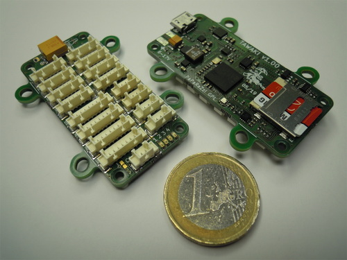

# ENAC boards

This repository contains various resources related to ENAC's UAV team electronic boards, like hardware source files, and software templates.

## Tawaki

This is the lastest autopilot board based on a STMicroelectronics STM32F777VI.

