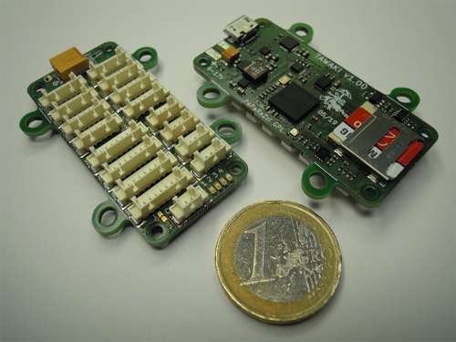

# Tawaki

This is the lastest autopilot board based on a STMicroelectronics STM32F777VI.

Find more details in the [Paparazzi UAV wiki](http://wiki.paparazziuav.org/wiki/Tawaki/v1.10).

+ **tawaki_chibios**: ChibiOS 20.3 basic example for Tawaki
+ **hardware**: electronic schematics and board KiCad files

